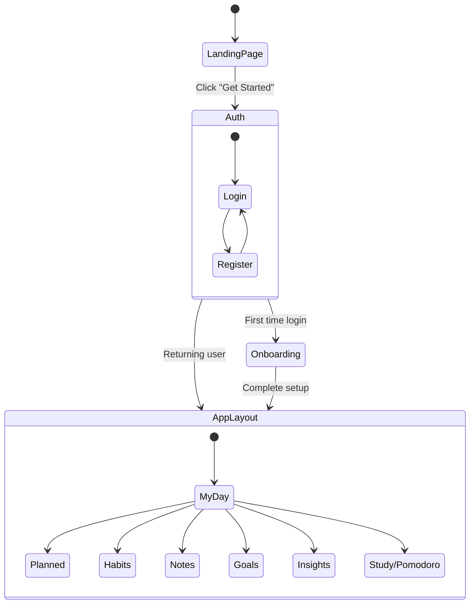

# Application Flow

**Purpose:** Understanding the user journey and application flow in LifeXOS is crucial for navigating the codebase and contributing to the project.
**Last Updated:** 2026-07-31

## Table of Contents
- [User Journey](#user-journey)
- [Detailed Flow Breakdown](#detailed-flow-breakdown)

## User Journey

## Detailed Flow Breakdown

### 1. Landing & Authentication (`Landing.tsx`, `Auth.tsx`)
- Unauthenticated users land on `Landing.tsx`.
- The application uses Supabase Auth. Users can sign up or log in via `Auth.tsx`.
- Session state is managed globally. Upon successful authentication, the user is redirected to the main app.

### 2. Onboarding (`OnboardingModal.tsx`)
- If a user is logging in for the first time (detected via user metadata in Supabase), they are presented with the `OnboardingModal.tsx`.
- This modal guides them through creating their first **Workspace**, setting initial preferences, and introducing them to Orbit AI.

### 3. Main Application (`AppLayout.tsx` & `AppSidebar.tsx`)
- The core application is wrapped in `AppLayout.tsx`, which provides the responsive structure.
- `AppSidebar.tsx` serves as the primary navigation hub, allowing users to switch between modules (MyDay, Habits, Notes, etc.) and switch active workspaces.

### 4. Module Interaction
Each module in `src/pages/` is designed to be interconnected:
- **MyDay (`MyDay.tsx`):** Pulls data from Tasks, Habits, and Calendar. It is the default view.
- **Tasks & Drag-and-Drop:** Adding a task via `QuickAdd.tsx` updates the database. The `SortableTaskList` component uses `@dnd-kit` to allow users to visually reorder tasks. This triggers an optimistic UI update and a background database sync.
- **Notes (`Notes.tsx`):** Users can write Markdown notes. Future flows include generating tasks directly from note action items.

### 5. Orbit AI Interaction
Orbit AI runs concurrently alongside the main flow. 
- It monitors the user's active page and current workspace (via `useOrbitMemory.ts`).
- Users can toggle the AI sidebar at any time to ask questions, request summaries, or get productivity advice.
- Orbit AI can also push notifications (via `useOrbitNotifications.ts`) if it notices the user hasn't completed a scheduled habit or task.

**Related Documents:**
- [Index](index.md)