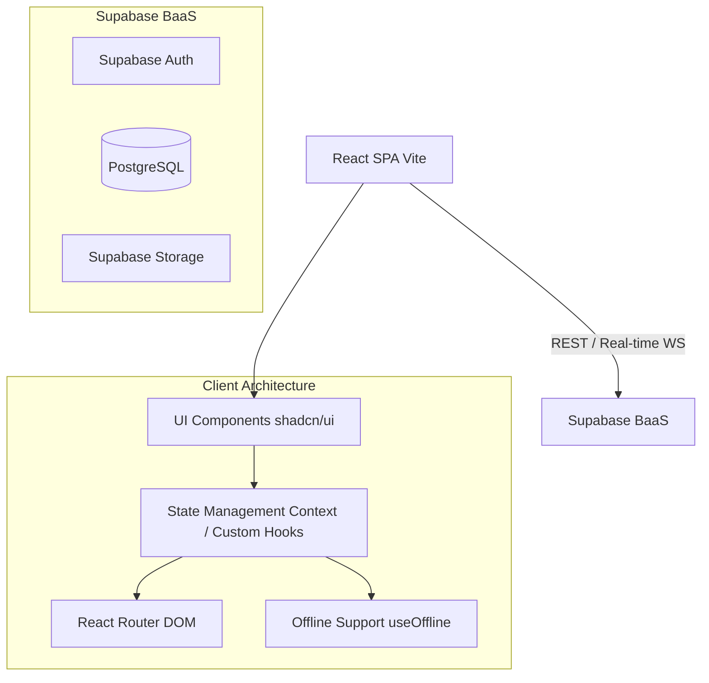

# Architecture

**Purpose:** LifeXOS is designed as a modern Single Page Application (SPA) with a robust Backend-as-a-Service (BaaS) integration. The architecture prioritizes speed, responsiveness, and offline capabilities.
**Last Updated:** 2026-07-31

## Table of Contents
- [High-Level Diagram](#high-level-diagram)
- [Frontend Architecture](#frontend-architecture)
- [Backend Architecture (Supabase)](#backend-architecture-supabase)
- [Extensibility](#extensibility)

## High-Level Diagram

## Frontend Architecture

The frontend is a React 18 application built using Vite. It follows a modular and component-driven architecture.

### Component Design
We utilize **shadcn/ui** and **Tailwind CSS** to build reusable, accessible, and customizable UI components. The application layout is orchestrated by two primary structural components:
- `AppLayout.tsx`: The main wrapper that handles the global structure (header, main content area, responsive behavior).
- `AppSidebar.tsx`: The navigation sidebar that manages workspace switching and module routing.

### State Management
State is managed using a combination of:
- **React Context:** For global UI state (theme, sidebar toggle, current workspace).
- **Custom Hooks:** Hooks like `useLifeXOS.ts` encapsulate business logic and data fetching, ensuring components remain clean and focused on presentation.
- **Local State:** Component-specific state using standard `useState` and `useReducer`.

### Offline Capabilities
LifeXOS is designed to be resilient. The `useOffline.ts` hook monitors network status. While full offline mutation syncing is on the roadmap, the application gracefully degrades, allowing users to view cached data (via Service Workers/PWA capabilities configured in Vite) and alerting them when they lose connectivity.

## Backend Architecture (Supabase)

LifeXOS leverages Supabase as its entire backend infrastructure.

- **Authentication:** Supabase Auth handles user registration, login, and secure session management.
- **Database:** A robust PostgreSQL database stores all user data (Tasks, Notes, Habits, Goals). We utilize Row Level Security (RLS) to ensure that users can only access their own workspace data.
- **Real-time:** Supabase's real-time subscriptions allow LifeXOS to reflect changes instantly across multiple devices. If you update a task on your phone, your desktop view updates immediately.

## Extensibility

The architecture is built with extensibility in mind. Adding a new module (e.g., a Calendar view) simply requires:
1. Creating a new page component in `src/pages`.
2. Adding a route in `App.tsx`.
3. Integrating the navigation link in `AppSidebar.tsx`.
4. Creating the associated Supabase tables and connecting them via custom hooks.

**Related Documents:**
- [Index](index.md)