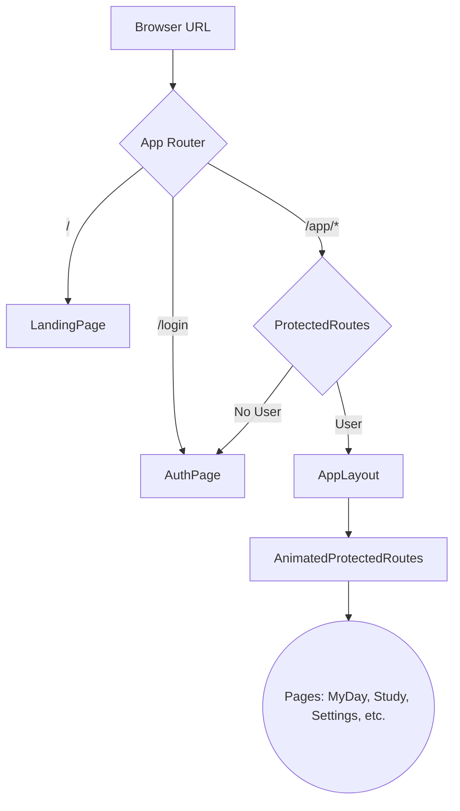

# Routing

Routing in LifeXOS is handled by `react-router-dom` v6 within `src/App.tsx`.

## Route Setup
1. **Lazy Components**: All major page components are wrapped in `React.lazy()` to enable code-splitting.
2. **Animation Wrapper**: Routes under the `/app/*` path are wrapped in a `PageWrapper` component that applies a `framer-motion` enter/exit animation.
3. **Protected Routes**: The `ProtectedRoutes` component checks for an authenticated user via `useAuth()`. If unauthenticated, it redirects to `/login`.
4. **App Layout**: Authenticated routes are rendered inside the `AppLayout` component, which includes the sidebar and global navigation elements.

## Flow

## Special Handlers
- **Catch-all (`*`)**: Renders a `NotFound` page.
- **Aliases**: Several paths redirect to canonical URLs (e.g., `/stats` -> `/app/insights`, `/calendar` -> `/app/planned`).
- **Auth Callback**: Displays a loading spinner if URL query parameters contain OAuth codes or tokens.
